<div align="center">


# 🏛️ AKADEMİK İŞLETİM SİSTEMİ
### *Mültidisipliner Ustalık — Milyar Dolarlık Bireyler İçin* 💎🚀

[](https://github.com/bahattinyunus)
[](./)
[](./)
[](./)

---

> **"Geleceğin dünyasını inşa eden 'Mültidisipliner Solopreneur'lar için tasarlanmış, yapay zeka entegreli akademik bir işletim sistemi ve bilgi cephaneliği."** 💎🦾🚀

---

</div>

## 🏛️ MİMARİ ŞEMA

```mermaid
graph TD
    A["🏛️ AKADEMİK İŞLETİM SİSTEMİ"] --> B["⚙️ MÜHENDİSLİK"]
    A --> C["🏛️ MİMARLIK & TASARIM"]
    A --> D["🔬 DOĞA BİLİMLERİ"]
    A --> E["🏥 TIP & SAĞLIK"]
    A --> F["⚖️ SOSYAL BİLİMLER"]
    A --> G["📉 İKTİSAT & İŞLETME"]
    A --> H["🚀 GELECEK TEKNOLOJİ"]
    A --> I["🎭 GÜZEL SANATLAR"]
    A --> J["📡 İLETİŞİM"]
    A --> K["⚖️ HUKUK"]
    A --> L["🌾 ZİRAAT & ÇEVRE"]
    A --> M["🎓 EĞİTİM"]
    A --> N["🕌 İLAHİYAT"]
    A --> O["🏃 SPOR"]
    A --> P["🏨 TURİZM"]

    subgraph "Temel Bilimler ve Mühendislik"
        B
        C
        D
    end

    subgraph "Sağlık ve Yaşam"
        E
        L
    end

    subgraph "Toplum ve İnsan"
        F
        G
        K
        J
    end

    subgraph "Vizyon ve Gelecek"
        H
        I
        M
        N
        O
        P
    end
```



---

> **"Kendi imparatorluğunu kurmak için gereken tüm akademik silahlar burada."** ⚔️🔥

---

## 🌌 Yeni Dünya Manifestosu: Mültidisipliner Zeka

Yapay zeka çağında, sadece bir "alan uzmanı" olmak yetersizdir. Gelecek, mühendislik kodunu hukuk etiğiyle, mimari estetiği ekonomik sürdürülebilirlikle birleştiren **"Mültidisipliner Solopreneur"**ların olacaktır.

> **"Geleceği tahmin etmenin tek yolu, onu mültidisipliner bir zekayla bizzat tasarlamaktır."** 🚀

---

## 🎮 FAKÜLTELERİ KEŞFET

| Fakülte | Bölüm Sayısı | Bağlantı |
| :--- | :---: | :---: |
| ⚙️ **Mühendislik** | 28 | [](FAK_MUHENDISLIK/) |
| 🏛️ **Mimarlık & Tasarım** | 8 | [](FAK_MIMARLIK_VE_TASARIM/) |
| 🔬 **Doğa ve Uygulamalı Bilimler** | 6 | [](FAK_DOGAN_VE_UYGULAMALI_BILIMLER/) |
| 🏥 **Tıp ve Sağlık** | 8 | [](FAK_TIP_VE_SAGLIK/) |
| ⚖️ **Sosyal Bilimler** | 9 | [](FAK_SOSYAL_BILIMLER/) |
| 📉 **İktisat ve İşletme** | 5 | [](FAK_IKTISAT_VE_ISLETME/) |
| 🚀 **Gelecek ve İleri Teknoloji** | 10 | [](FAK_GELECEK_VE_ILERI_TEKNOLOJI/) |
| 🎭 **Güzel Sanatlar & Tasarım** | 5 | [](FAK_GUZEL_SANATLAR_VE_TASARIM/) |
| 📡 **İletişim** | 4 | [](FAK_ILETISIM/) |
| ⚖️ **Hukuk** | 5 | [](FAK_HUKUK/) |
| 🌾 **Ziraat, Ormancılık & Çevre** | 7 | [](FAK_ZIRAAT_ORMANCILIK_VE_CEVRE/) |
| 🎓 **Eğitim** | 6 | [](FAK_EGITIM/) |
| 🕌 **İlahiyat** | 3 | [](FAK_ILAHIYAT/) |
| 🏃 **Spor Bilimleri** | 4 | [](FAK_SPOR_BILIMLERI/) |
| 🏨 **Turizm ve Otelcilik** | 3 | [](FAK_TURIZM_VE_OTELCILIK/) |

---

## 🌳 MASTER BİLGİ AĞACI

<details>
<summary><b>⚙️ FAK_MUHENDISLIK (Mühendislik Fakültesi) — 28 Bölüm — Tıklayın</b></summary>
<br>

| Branş | Bölüm |
| :--- | :--- |
| 💻 **Yazılım & BT** | [Bilgisayar Müh.](FAK_MUHENDISLIK/bilgisayar_mühendisligi) • [Yazılım Müh.](FAK_MUHENDISLIK/yazilim_mühendisligi) • [Bilişim Sistemleri](FAK_MUHENDISLIK/bilişim_sistemleri_mühendisligi) • [Adli Bilişim](FAK_MUHENDISLIK/adli_bilisim_mühendisligi) |
| ⚡ **Elektronik** | [Elektrik-Elektronik Müh.](FAK_MUHENDISLIK/elektrik_elektronik_mühendisligi) • [Elektronik Haberleşme](FAK_MUHENDISLIK/elektronik_haberlesme_muhendisligi) • [Optik](FAK_MUHENDISLIK/optik_mühendisligi) • [Akustik](FAK_MUHENDISLIK/akustik_mühendisligi) |
| 🤖 **Robotik & AI** | [Mekatronik](FAK_MUHENDISLIK/mekatronik_mühendisligi) • [Yapay Zeka & Veri](FAK_MUHENDISLIK/yapay_zeka_ve_veri_mühendisligi) • [Kontrol-Otomasyon](FAK_MUHENDISLIK/kontrol-otomasyon_mühendisligi) |
| ⚙️ **Mekanik** | [Makine](FAK_MUHENDISLIK/makine_mühendisligi) • [İmalat](FAK_MUHENDISLIK/imalat_mühendisligi) • [Mekatronik](FAK_MUHENDISLIK/mekatronik_mühendisligi) • [Endüstri](FAK_MUHENDISLIK/endüstri_mühendisligi) |
| 🏗️ **İnşaat & Enerji** | [İnşaat](FAK_MUHENDISLIK/inşaat_mühendisligi) • [Enerji Sistemleri](FAK_MUHENDISLIK/enerji-sistemleri_mühendisligi) • [Harita](FAK_MUHENDISLIK/harita_mühendisligi) |
| ✈️ **Havacılık** | [Havacılık ve Uzay](FAK_MUHENDISLIK/havacilik_uzay_mühendisligi) |
| 🧪 **Proses & Malzeme** | [Kimya](FAK_MUHENDISLIK/kimya_mühendisligi) • [Metalurji](FAK_MUHENDISLIK/metalurji_malzeme_mühendisligi) • [Maden](FAK_MUHENDISLIK/maden_muhendisligi) • [Tekstil](FAK_MUHENDISLIK/tekstil_muhendisligi) |
| 🧬 **Biyomedikal** | [Biyomedikal](FAK_MUHENDISLIK/biyomedikal_mühendisligi) • [Nöro Müh.](FAK_MUHENDISLIK/nöro_mühendisligi) • [Biyosistem](FAK_MUHENDISLIK/biyosistem_muhendisligi) |
| 💥 **Özel** | [Patlayıcı Müh.](FAK_MUHENDISLIK/patlayıcı_mühendisligi) • [Endüstriyel Tasarım](FAK_MUHENDISLIK/endustriyel_tasarim_muhendisligi) |

</details>

<details>
<summary><b>🏛️ FAK_MIMARLIK_VE_TASARIM — Tıklayın</b></summary>
<br>

| Kategori | Bağlantı |
| :--- | :--- |
| 🏛️ **Tasarım** | [Tasarım Stüdyoları](FAK_MIMARLIK_VE_TASARIM/tasarim_studyolari) • [Görsel İletişim](FAK_MIMARLIK_VE_TASARIM/gorsel_iletisim_ve_anlatim) |
| 📚 **Teori** | [Mimarlık Tarihi](FAK_MIMARLIK_VE_TASARIM/mimarlik_tarihi_ve_teorisi) • [Restorasyon](FAK_MIMARLIK_VE_TASARIM/restorasyon_ve_koruma) |
| 🛠️ **Teknoloji** | [Yapı Teknolojisi](FAK_MIMARLIK_VE_TASARIM/yapi_teknolojisi_ve_malzeme) • [Yapı Fiziği](FAK_MIMARLIK_VE_TASARIM/yapi_fizigi_ve_cevre) |
| 🌐 **Kentsel** | [Şehircilik ve Peyzaj](FAK_MIMARLIK_VE_TASARIM/sehircilik_ve_peyzaj) |
| 💻 **Dijital** | [CAD/BIM](FAK_MIMARLIK_VE_TASARIM/bilgisayar_destekli_tasarim) |

</details>

<details>
<summary><b>🔬 FAK_DOGAN_VE_UYGULAMALI_BILIMLER — Tıklayın</b></summary>
<br>

| Bilim Dalı | Bağlantı |
| :--- | :--- |
| 🔢 **Matematik** | [Matematik](FAK_DOGAN_VE_UYGULAMALI_BILIMLER/matematik) |
| ⚛️ **Fizik** | [Fizik](FAK_DOGAN_VE_UYGULAMALI_BILIMLER/fizik) |
| 🧪 **Kimya** | [Kimya](FAK_DOGAN_VE_UYGULAMALI_BILIMLER/kimya) |
| 🧬 **Biyoloji** | [Biyoloji](FAK_DOGAN_VE_UYGULAMALI_BILIMLER/biyoloji) |
| 📊 **İstatistik** | [İstatistik](FAK_DOGAN_VE_UYGULAMALI_BILIMLER/istatistik) |
| 🔭 **Astronomi** | [Astronomi ve Astrofizik](FAK_DOGAN_VE_UYGULAMALI_BILIMLER/astronomi_ve_astrofizik) |

</details>

<details>
<summary><b>🏥 FAK_TIP_VE_SAGLIK — Tıklayın</b></summary>
<br>

| Alan | Bağlantı |
| :--- | :--- |
| 🩺 **Tıp** | [Tıp Fakültesi](FAK_TIP_VE_SAGLIK/tıp) • [Diş Hekimliği](FAK_TIP_VE_SAGLIK/dis_hekimligi) |
| 💊 **Eczacılık** | [Eczacılık](FAK_TIP_VE_SAGLIK/eczacilik) |
| 🧬 **Biyomedikal** | [Moleküler Biyoloji ve Genetik](FAK_TIP_VE_SAGLIK/molekuler_biyoloji_genetik) |
| 🩺 **Hemşirelik** | [Hemşirelik](FAK_TIP_VE_SAGLIK/hemsirelik) |
| 🏋️ **Fizyoterapi** | [Fizyoterapi ve Rehabilitasyon](FAK_TIP_VE_SAGLIK/fizyoterapi_ve_rehabilitasyon) |
| 🥗 **Beslenme** | [Beslenme ve Diyetetik](FAK_TIP_VE_SAGLIK/beslenme_ve_diyetetik) |
| 🏥 **Yönetim** | [Sağlık Yönetimi](FAK_TIP_VE_SAGLIK/saglik_yonetimi) |

</details>

<details>
<summary><b>⚖️ FAK_SOSYAL_BILIMLER & 📉 FAK_IKTISAT_VE_ISLETME — Tıklayın</b></summary>
<br>

| Disiplin | Bağlantı |
| :--- | :--- |
| 👥 **Sosyal** | [Sosyoloji](FAK_SOSYAL_BILIMLER/sosyoloji) • [Psikoloji](FAK_SOSYAL_BILIMLER/piskoloji) • [Antropoloji](FAK_SOSYAL_BILIMLER/antropoloji) • [Dilbilim](FAK_SOSYAL_BILIMLER/dilbilim) |
| 🧠 **Beşeri** | [Felsefe](FAK_SOSYAL_BILIMLER/felsefe) • [Tarih](FAK_SOSYAL_BILIMLER/tarih) • [Coğrafya](FAK_SOSYAL_BILIMLER/cografya) |
| 🌍 **Siyaset** | [Uluslararası İlişkiler](FAK_SOSYAL_BILIMLER/uluslararasi_iliskiler) • [Kamu Yönetimi](FAK_SOSYAL_BILIMLER/kamu_yonetimi) |
| 💰 **Ekonomi** | [İktisat](FAK_IKTISAT_VE_ISLETME/iktisat) • [Ekonomi](FAK_IKTISAT_VE_ISLETME/ekonomi) • [Maliye](FAK_IKTISAT_VE_ISLETME/maliye) |
| 🏢 **İşletme** | [İşletme](FAK_IKTISAT_VE_ISLETME/işletme) • [Finans Müh.](FAK_IKTISAT_VE_ISLETME/finans_mühendisligi) |

</details>

<details>
<summary><b>⚖️ FAK_HUKUK — Tıklayın</b></summary>
<br>

| Alan | Bağlantı |
| :--- | :--- |
| ⚖️ **Özel Hukuk** | [Medeni Hukuk](FAK_HUKUK/medeni_hukuk) • [Ticaret Hukuku](FAK_HUKUK/ticaret_hukuku) |
| 🏛️ **Kamu** | [Kamu Hukuku](FAK_HUKUK/kamu_hukuku) |
| 🌐 **Uluslararası** | [Uluslararası Hukuk](FAK_HUKUK/uluslararasi_hukuk) |
| 🤖 **Teknoloji & Hukuk** | [Hukuk ve AI Etiği](FAK_HUKUK/hukuk_ve_ai_etigi) |

</details>

<details>
<summary><b>🚀 FAK_GELECEK_VE_ILERI_TEKNOLOJI — Tıklayın</b></summary>
<br>

| Alan | Bağlantı |
| :--- | :--- |
| ⚛️ **Kuantum** | [Kuantum Müh.](FAK_GELECEK_VE_ILERI_TEKNOLOJI/kuantum_mühendisligi) |
| 🧬 **Biyo-Nano** | [Biyoteknik & Nanotıp](FAK_GELECEK_VE_ILERI_TEKNOLOJI/biyoteknik_nanotıp) • [Nano Müh.](FAK_GELECEK_VE_ILERI_TEKNOLOJI/nano_mühendislik) • [Nanoteknoloji AI](FAK_GELECEK_VE_ILERI_TEKNOLOJI/nanoteknoloji_ai) |
| 🕶️ **Sanal Evren** | [Metaverse](FAK_GELECEK_VE_ILERI_TEKNOLOJI/metaverse) • [AR Müh.](FAK_GELECEK_VE_ILERI_TEKNOLOJI/artırılmıs_gerceklik_mühendisligi) |
| 🧠 **Zihin-Makine** | [BCI](FAK_GELECEK_VE_ILERI_TEKNOLOJI/bci) • [Context Engineering](FAK_GELECEK_VE_ILERI_TEKNOLOJI/contex_engineering) |
| 🤖 **AI & Üretim** | [3D Print AI](FAK_GELECEK_VE_ILERI_TEKNOLOJI/3d_print_ai) • [Fintek AI](FAK_GELECEK_VE_ILERI_TEKNOLOJI/fintek_ai) |

</details>

<details>
<summary><b>🎭 FAK_GUZEL_SANATLAR_VE_TASARIM & 📡 FAK_ILETISIM — Tıklayın</b></summary>
<br>

| Alan | Bağlantı |
| :--- | :--- |
| 🎨 **Sanat** | [Güzel Sanatlar](FAK_GUZEL_SANATLAR_VE_TASARIM/guzel_sanatlar) • [Görsel İletişim Tasarımı](FAK_GUZEL_SANATLAR_VE_TASARIM/gorsel_iletisim_tasarimi) |
| 🎵 **Müzik** | [Müzik](FAK_GUZEL_SANATLAR_VE_TASARIM/muzik) |
| 🛋️ **Tasarım** | [İç Mimarlık](FAK_GUZEL_SANATLAR_VE_TASARIM/ic_mimarlik_ve_cevre_tasarimi) • [Moda & Tekstil](FAK_GUZEL_SANATLAR_VE_TASARIM/moda_ve_tekstil_tasarimi) |
| 🎬 **Medya** | [Radyo TV Sinema](FAK_ILETISIM/radyo_tv_sinema) • [Gazetecilik](FAK_ILETISIM/gazetecilik) |
| 📣 **İletişim** | [Halkla İlişkiler](FAK_ILETISIM/halkla_iliskiler_ve_reklamcilik) • [Yeni Medya](FAK_ILETISIM/yeni_medya_ve_iletisim) |

</details>

<details>
<summary><b>🌾 FAK_ZIRAAT_ORMANCILIK_VE_CEVRE — Tıklayın</b></summary>
<br>

| Alan | Bağlantı |
| :--- | :--- |
| 🌱 **Tarım** | [Ziraat Müh.](FAK_ZIRAAT_ORMANCILIK_VE_CEVRE/ziraat_mühendisligi) • [Biyosistem Müh.](FAK_MUHENDISLIK/biyosistem_muhendisligi) |
| 🌲 **Orman** | [Ormancılık](FAK_ZIRAAT_ORMANCILIK_VE_CEVRE/ormancilik) • [Peyzaj Mimarlığı](FAK_ZIRAAT_ORMANCILIK_VE_CEVRE/peyzaj_mimarligi) |
| 🌊 **Su & Gıda** | [Su Ürünleri](FAK_ZIRAAT_ORMANCILIK_VE_CEVRE/su_urunleri) • [Gıda Müh.](FAK_ZIRAAT_ORMANCILIK_VE_CEVRE/gida_muhendisligi) |
| ♻️ **Çevre** | [Çevre Müh.](FAK_ZIRAAT_ORMANCILIK_VE_CEVRE/çevre_mühendisligi) • [Jeoloji Müh.](FAK_ZIRAAT_ORMANCILIK_VE_CEVRE/jeoloji_mühendisligi) |

</details>

<details>
<summary><b>🎓 FAK_EGITIM & 🕌 FAK_ILAHIYAT & 🏃 FAK_SPOR_BILIMLERI & 🏨 FAK_TURIZM_VE_OTELCILIK — Tıklayın</b></summary>
<br>

| Fakülte | Bölümler |
| :--- | :--- |
| 🎓 **Eğitim** | [Sınıf Öğr.](FAK_EGITIM/sinif_ogretmenligi) • [Matematik Öğr.](FAK_EGITIM/matematik_ogretmenligi) • [Fen Öğr.](FAK_EGITIM/fen_bilimleri_ogretmenligi) • [PDR](FAK_EGITIM/pdr) • [BÖTE](FAK_EGITIM/bilgisayar_ve_ogretim_teknolojileri) • [Eğitim Yön.](FAK_EGITIM/egitim_yonetimi) |
| 🕌 **İlahiyat** | [Temel İslam Bilimleri](FAK_ILAHIYAT/temel_islam_bilimleri) • [İslam Tarihi](FAK_ILAHIYAT/islam_tarihi_ve_sanatlari) • [Din Kültürü Öğr.](FAK_ILAHIYAT/din_kulturu_ogretmenligi) |
| 🏃 **Spor** | [Beden Eğitimi Öğr.](FAK_SPOR_BILIMLERI/beden_egitimi_ve_spor_ogretmenligi) • [Antrenörlük](FAK_SPOR_BILIMLERI/antrenorluk_egitimi) • [Spor Yön.](FAK_SPOR_BILIMLERI/spor_yoneticiligi) • [Rekreasyon](FAK_SPOR_BILIMLERI/rekreasyon) |
| 🏨 **Turizm** | [Turizm İşl.](FAK_TURIZM_VE_OTELCILIK/turizm_isletmeciligi) • [Gastronomi](FAK_TURIZM_VE_OTELCILIK/gastronomi_ve_mutfak_sanatlari) • [Konaklama](FAK_TURIZM_VE_OTELCILIK/konaklama_isletmeciligi) |

</details>

---

## 🌳 Detaylı Dizin Ağacı

<details>
<summary><b>📂 Tüm klasör yapısını görüntülemek için tıklayın</b></summary>
<br>

```text
university-courses/
├── FAK_MUHENDISLIK/          (28 bölüm)
├── FAK_MIMARLIK_VE_TASARIM/  (8 bölüm)
├── FAK_DOGAN_VE_UYGULAMALI_BILIMLER/ (6 bölüm)
├── FAK_TIP_VE_SAGLIK/        (8 bölüm)
├── FAK_SOSYAL_BILIMLER/      (9 bölüm)
├── FAK_IKTISAT_VE_ISLETME/   (5 bölüm)
├── FAK_HUKUK/                (5 bölüm)
├── FAK_GELECEK_VE_ILERI_TEKNOLOJI/ (10 bölüm)
├── FAK_GUZEL_SANATLAR_VE_TASARIM/  (5 bölüm)
├── FAK_ILETISIM/             (4 bölüm)
├── FAK_ZIRAAT_ORMANCILIK_VE_CEVRE/ (7 bölüm)
├── FAK_EGITIM/               (6 bölüm)
├── FAK_ILAHIYAT/             (3 bölüm)
├── FAK_SPOR_BILIMLERI/       (4 bölüm)
├── FAK_TURIZM_VE_OTELCILIK/  (3 bölüm)
├── assets/
├── scripts/
├── templates/
└── readme.md
```

**Toplam: 15 Fakülte | 100+ Bölüm**

</details>

---

## 🧬 Mültidisipliner Sinerji Matrisi

| Alan A | Alan B | 🚀 Sinerji Sonucu |
| :--- | :--- | :--- |
| **Yazılım** | **Hukuk** | Akıllı sözleşmeler ve regülasyon uyumlu otonom sistemler. |
| **Mimarlık** | **Yapay Zeka** | Üretken tasarım (Generative Design) ve nöro-mimari mekanlar. |
| **Mühendislik** | **İktisat** | Maliyet optimizasyonlu otonom üretim tesisleri. |
| **Sosyoloji** | **Veri Bilimi** | Toplumsal davranış tahminleme ve dijital topluluk mühendisliği. |
| **Eğitim** | **AI** | Kişiselleştirilmiş öğrenme sistemleri ve adaptif pedagoji. |
| **Sağlık** | **Kuantum** | Kuantum tıp görüntüleme ve ilaç keşfi. |

---

## 🛠️ Solopreneur AI Araç Seti (V.2025)

> [!TIP]
> **"Harika bir zanaatkar, aletlerini en iyi tanıyan kişidir."**

### 🧠 Düşünce ve Strateji
- **Problem Çözme:** [Gemini 2.0 / GPT-o1] - Karmaşık analizler.
- **Veri Analizi:** [Claude 3.5 Sonnet] - Kod ve görselleştirme.
- **Akademik Araştırma:** [Perplexity AI] - Gerçek zamanlı bilgi.

### 🎨 Tasarım ve Estetik
- **Mimari & Görsel:** [Midjourney v6.1]
- **UI/UX:** [v0.dev / Figma AI]

### ⚙️ Operasyon ve Üretim
- **Otomasyon:** [Make.com / n8n]
- **Yazılım:** [Cursor / Windsurf]

---

## 🗺️ Gelecek Yol Haritası

- [ ] **Derinlemesine Ders Notları:** Her bölüm altına 101 ve ileri seviye ders içerikleri.
- [ ] **Interactive Playground:** Simülasyon araçları ve kod ortamları.
- [ ] **AI Entegrasyonu:** Her bölüme AI destekli özet ve soru-cevap eklentisi.

> **"Bilgi paylaşıldıkça çoğalır, mültidisipliner hale geldikçe güçlenir."** 🌐

---

## 🤝 Katkıda Bulunma

1. Bir **Issue** açın.
2. [`CONTRIBUTING.md`](CONTRIBUTING.md) dosyasını okuyun.
3. Kendi **Pull Request**inizi gönderin!

---

## ⚖️ Lisans

Bu repo **MIT Lisansı** ile korunmaktadır. Detaylar için [`LICENSE`](LICENSE) dosyasına bakın.

<div align="center">

**Hazırlayan:** Bahattin Yunus Çetin  
*Mühendis & Araştırmacı*

[Linkedin](https://linkedin.com/in/bahattinyunuscetin) | [GitHub](https://github.com/bahattinyunus)

</div>
