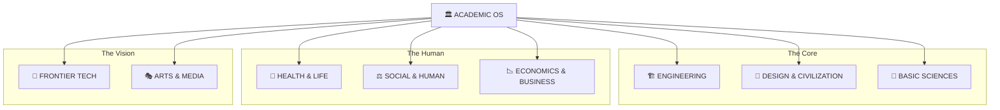

<div align="center">


# 🏛️ ACADEMIC OPERATING SYSTEM
### *Multidisciplinary Mastery for the Billion-Dollar Individual* 💎🚀

[](https://github.com/bahattinyunus)
[](.)
[](.)
[](.)

---

> **"Geleceğin dünyasını inşa eden 'Mültidisipliner Solopreneur'lar' için tasarlanmış, yapay zeka entegreli akademik bir işletim sistemi ve bilgi cephaneliği."** 💎🦾🚀

---

| 🪐 FOUNDATION | 🧪 INNOVATION | 📈 QUANTUM SCALE |
| :---: | :---: | :---: |
|  |  |  |

---

## 🏛️ ARCHITECTURAL BLUEPRINT


---

<details>
<summary><b>📖 BİLGELİK KÜTÜPHANESİ: Mültidisipliner Zihnin Referansları (Tıklayın)</b></summary>
<br>

#### 🧠 Birey ve Kaldıraç (The Individual & Leverage)
> *"Bana yeterince uzun bir kaldıraç ve üzerine koyabileceğim bir dayanak noktası verin, dünyayı yerinden oynatayım."* — **Arşimet** 🛡️⚡
>
> *"Spesifik bilgi; okulda öğrenilemeyen, sadece merakınızın peşinden giderek bulabileceğiniz bilgidir."* — **Naval Ravikant** 🧬
>
> *"Eğitim; insanın okulda öğrendiği her şeyi unuttuğunda geriye kalandır."* — **Albert Einstein** 🎓

#### ⚙️ Teknoloji ve Büyü (Magic & Scale)
> *"Yapay zeka, şimdiye kadar inşa ettiğimiz en büyük güçlendirici araç olacak."* — **Sam Altman** 🤖💎
>
> *"Teknoloji, sihire sahip olduğumuz en yakın şeydir."* — **Elon Musk** ⚡✨
>
> *"Bilgisayarlar, zihnimiz için birer bisiklet gibidir."* — **Steve Jobs** 🚲🧠

#### 🎨 Sanat ve Bilimin Kesişimi (The Polymath)
> *"Sanatın bilimini çalışın. Bilimin sanatını çalışın. Duyularınızı geliştirin — özellikle görmeyi öğrenin. Her şeyin birbiriyle bağlantılı olduğunu fark edin."* — **Leonardo da Vinci** 🎨🧬
>
> *"Demir kullanılmadığında paslanır; su durgunlaştığında saflığını kaybeder... hareketsizlik de zihnin gücünü öyle tüketir."* — **Leonardo da Vinci** 🏗️
>
> *"Gelecek; daha fazla yetenek öğrenen ve bunları yaratıcı yollarla birleştirenlerin olacaktır."* — **Robert Greene** 📈

#### 🗺️ Vizyon ve Strateji (Future)
> *"Geleceği tahmin etmenin en iyi yolu, onu yaratmaktır."* — **Peter Drucker** 🚀
>
> *"Gelecek zaten burada, sadece eşit dağıtılmadı."* — **William Gibson** 🌐
>
> *"Bir gemi inşa etmek istiyorsanız, insanları odun toplamak için toplamayın... Onlara uçsuz bucaksız denize karşı özlem duymayı öğretin."* — **Antoine de Saint-Exupéry** 🌊🚢

</details>

---

> **"Kendi imparatorluğunu kurmak için gereken tüm akademik silahlar burada."** ⚔️🔥

</div>

## 🌌 Yeni Dünya Manifestosu: Mültidisipliner Zeka
Yapay zeka çağında, sadece bir "alan uzmanı" olmak yetersizdir. Gelecek, mühendislik kodunu hukuk etiğiyle, mimari estetiği de ekonomik sürdürülebilirlikle birleştiren **"Mültidisipliner Solopreneur"**ların olacaktır.

### 💎 Bir Kişilik Devrim (The One-Person Movement)
Teknoloji, operasyonel sınırları yok etti. Bugün, tek bir birey; AI araçlarını kullanarak binlerce kişinin yapamadığı etkiyi yaratabilir. Bu repo, o bireyin zihinsel cephaneliğidir.

**Neden Buradasın?**
- 🛡️ **Bütünsel Güç:** Kod yazarken hukuki sınırları, bina çizerken robotik geleceği bilmek için.
- ⚡ **Otonom Gelecek:** Kendi kendine yeten, AI ile entegre bir "bilgi işçisi" değil, bir "bilgi mimarı" olmak için.
- 🧬 **Müfredat Üstü:** Üniversitelerin hantal yapısını aşan, dinamik ve vizyoner bir birikim için.

> **"Geleceği tahmin etmenin tek yolu, onu mültidisipliner bir zekayla bizzat tasarlamaktır."** 🚀
---

## 🎮 KONTROL MERKEZİ (Control Center)
*En kritik verilere tek tıkla erişin.*

| 📂 [Dizin Ağacı](file:///c:/github%20repolarım/engineering-courses/readme.md#detaylı-dizin-ağacı) | 🗺️ [Yol Haritası](file:///c:/github%20repolarım/engineering-courses/readme.md#gelecek-yol-haritası-bilginin-sınırlarını-genişletmek) | ⚖️ [Lisans](LICENSE) | 🤝 [Katkıda Bulun](CONTRIBUTING.md) |
| :---: | :---: | :---: | :---: |

---

## 🎮 DOMINION CONTROL CENTER
*En kritik verilere ve disiplinlere tek tıkla erişin.*

| 🏗️ **ENGINEERING** | 🎨 **DESIGN** | 🔬 **BASIC SCIENCES** | 🏥 **HEALTH** |
| :---: | :---: | :---: | :---: |
| [](ALAN_MUHENDISLIK/) | [](ALAN_TASARIM_MIMARLIK/) | [](ALAN_TEMEL_BILIMLER/) | [](ALAN_SAGLIK_YASAM/) |
| **[Bilgisayar](ALAN_MUHENDISLIK/bilgisayar_mühendisligi)** | **[Mimarlık](ALAN_TASARIM_MIMARLIK/01_Tasarim_Studyolari)** | **[Matematik](ALAN_TEMEL_BILIMLER/matematik)** | **[Tıp Fakültesi](ALAN_SAGLIK_YASAM/tıp)** |
| **[Elektrik-Elk.](ALAN_MUHENDISLIK/elektrik_elektronik_mühendisligi)** | **[Şehircilik](ALAN_TASARIM_MIMARLIK/05_Sehircilik_ve_Peyzaj)** | **[Fizik](ALAN_TEMEL_BILIMLER/fizik)** | **[Eczacılık](ALAN_SAGLIK_YASAM/eczacilik)** |
| **[Mekatronik](ALAN_MUHENDISLIK/mekatronik_mühendisligi)** | **[CAD/BIM](ALAN_TASARIM_MIMARLIK/08_Bilgisayar_Destekli_Tasarim)** | **[Kimya](ALAN_TEMEL_BILIMLER/kimya)** | **[Genetik](ALAN_SAGLIK_YASAM/molekuler_biyoloji_genetik)** |

| ⚖️ **SOCIAL** | 📉 **ECONOMICS** | 🚀 **FRONTIER** | 🧠 **STRATEGIC** |
| :---: | :---: | :---: | :---: |
| [](ALAN_SOSYAL_INSAN/) | [](ALAN_EKONOMI_ISLETME/) | [](ALAN_ONE_TEKNOLOJI/) | [](ALAN_STRATEJIK_ZEKA/) |
| **[Hukuk](ALAN_SOSYAL_INSAN/medeni_hukuk)** | **[İktisat](ALAN_EKONOMI_ISLETME/iktisat)** | **[Kuantum](ALAN_ONE_TEKNOLOJI/kuantum_mühendisligi)** | **[Oyun Teorisi](ALAN_STRATEJIK_ZEKA/README.md)** |
| **[Sosyoloji](ALAN_SOSYAL_INSAN/sosyoloji)** | **[İşletme](ALAN_EKONOMI_ISLETME/işletme)** | **[Metaverse](ALAN_ONE_TEKNOLOJI/metaverse)** | **[Zihinsel Modeller](ALAN_STRATEJIK_ZEKA/README.md)** |
| **[Felsefe](ALAN_SOSYAL_INSAN/felsefe)** | **[Finans](ALAN_EKONOMI_ISLETME/finans_mühendisligi)** | **[BCI](ALAN_ONE_TEKNOLOJI/bci)** | **[Strateji](ALAN_STRATEJIK_ZEKA/README.md)** |

| 💎 **MASTERY** | 🎭 **ARTS** | 🏗️ **ARCHITECT** | 🏥 **HEALTH** |
| :---: | :---: | :---: | :---: |
| [](ALAN_KISISEL_GELISIM/) | [](ALAN_SANAT_MEDYA/) | [](ALAN_TASARIM_MIMARLIK/) | [](ALAN_SAGLIK_YASAM/) |
| **[Deep Work](ALAN_KISISEL_GELISIM/README.md)** | **[Güz. Sanatlar](ALAN_SANAT_MEDYA/guzel_sanatlar)** | **[Mimarlık](ALAN_TASARIM_MIMARLIK/01_Tasarim_Studyolari)** | **[Tıp Fakültesi](ALAN_SAGLIK_YASAM/tıp)** |
| **[Bio-Hacking](ALAN_KISISEL_GELISIM/README.md)** | **[Sinema & TV](ALAN_SANAT_MEDYA/radyo_tv_sinema)** | **[Şehircilik](ALAN_TASARIM_MIMARLIK/05_Sehircilik_ve_Peyzaj)** | **[Eczacılık](ALAN_SAGLIK_YASAM/eczacilik)** |
| **[Verimlilik](ALAN_KISISEL_GELISIM/README.md)** | **[UI/UX](ALAN_SANAT_MEDYA/gorsel_iletisim_tasarimi)** | **[CAD/BIM](ALAN_TASARIM_MIMARLIK/08_Bilgisayar_Destekli_Tasarim)** | **[Genetik](ALAN_SAGLIK_YASAM/molekuler_biyoloji_genetik)** |

---

## 🌳 MASTER KNOWLEDGE TREE
*Tüm modüllere tam erişim sağlayan devasa bilgi ağı.*

<details>
<summary><b>🛠️ ALAN_MUHENDISLIK (Mühendislik Harikaları) - Tıklayın</b></summary>
<br>

| Branş | Modül / Ders |
| :--- | :--- |
| 💻 **Yazılım & IT** | [Bilgisayar Mühendisliği](ALAN_MUHENDISLIK/bilgisayar_mühendisligi) • [Yazılım Mühendisliği](ALAN_MUHENDISLIK/yazilim_mühendisligi) • [Bilişim Sistemleri](ALAN_MUHENDISLIK/bilişim_sistemleri_mühendisligi) • [Adli Bilişim](ALAN_MUHENDISLIK/adli_bilisim_mühendisligi) |
| ⚡ **Elektronik & Haberleşme** | [Elektrik-Elektronik Mühendisliği](ALAN_MUHENDISLIK/elektrik_elektronik_mühendisligi) • [Elektronik Haberleşme Mühendisliği](ALAN_MUHENDISLIK/elektronik_haberlesme_muhendisligi) • [Optik Mühendisliği](ALAN_MUHENDISLIK/optik_mühendisligi) |
| 🤖 **Robotik & AI** | [Mekatronik Mühendisliği](ALAN_MUHENDISLIK/mekatronik_mühendisligi) • [Yapay Zeka ve Veri Mühendisliği](ALAN_MUHENDISLIK/yapay_zeka_ve_veri_mühendisligi) • [Kontrol ve Otomasyon](ALAN_MUHENDISLIK/kontrol-otomasyon_mühendisligi) |
| ⚙️ **Mekanik & İmalat** | [Makine Mühendisliği](ALAN_MUHENDISLIK/makine_mühendisligi) • [İmalat Mühendisliği](ALAN_MUHENDISLIK/imalat_mühendisligi) • [Endüstriyel Tasarım Mühendisliği](ALAN_MUHENDISLIK/endustriyel_tasarim_muhendisligi) |
| 🏗️ **İnşaat & Enerji** | [İnşaat Mühendisliği](ALAN_MUHENDISLIK/inşaat_mühendisligi) • [Enerji Sistemleri Mühendisliği](ALAN_MUHENDISLIK/enerji-sistemleri_mühendisligi) • [Harita Mühendisliği](ALAN_MUHENDISLIK/harita_mühendisligi) |
| ✈️ **Havacılık & Uzay** | [Havacılık ve Uzay Mühendisliği](ALAN_MUHENDISLIK/havacilik_uzay_mühendisligi) |
| 🧪 **Proses & Malzeme** | [Kimya Mühendisliği](ALAN_MUHENDISLIK/kimya_mühendisligi) • [Metalurji ve Malzeme Mühendisliği](ALAN_MUHENDISLIK/metalurji_malzeme_mühendisligi) • [Jeoloji Mühendisliği](ALAN_MUHENDISLIK/jeoloji_mühendisligi) |
| 🌾 **Ziraat & Çevre** | [Ziraat Mühendisliği](ALAN_MUHENDISLIK/ziraat_mühendisligi) • [Çevre Mühendisliği](ALAN_MUHENDISLIK/çevre_mühendisligi) |

</details>

<details>
<summary><b>🧠 DOMINION_STRATEGIC & 💎 PERSONAL MASTERY - Tıklayın</b></summary>
<br>

| Kategori | Erişim |
| :--- | :--- |
| ♟️ **Stratejik Zeka** | [Oyun Teorisi](ALAN_STRATEJIK_ZEKA/README.md) • [Zihinsel Modeller](ALAN_STRATEJIK_ZEKA/README.md) • [Jeopolitik](ALAN_STRATEJIK_ZEKA/README.md) |
| 🦾 **Kişisel Ustalık** | [Deep Work](ALAN_KISISEL_GELISIM/README.md) • [Bio-Hacking](ALAN_KISISEL_GELISIM/README.md) • [Zihinsel Dayanıklılık](ALAN_KISISEL_GELISIM/README.md) |

</details>

<details>
<summary><b>🎨 ALAN_TASARIM_MIMARLIK (Mimarlık ve Şehir) - Tıklayın</b></summary>
<br>

| Kategori | İçerik |
| :--- | :--- |
| 🏛️ **Tasarım** | [Tasarım Stüdyoları](ALAN_TASARIM_MIMARLIK/01_Tasarim_Studyolari) • [Görsel İletişim](ALAN_TASARIM_MIMARLIK/04_Gorsel_Iletisim_ve_Anlatim) |
| 📚 **Teori** | [Mimarlık Tarihi ve Teorisi](ALAN_TASARIM_MIMARLIK/02_Mimarlik_Tarihi_ve_Teorisi) • [Restorasyon ve Koruma](ALAN_TASARIM_MIMARLIK/06_Restorasyon_ve_Koruma) |
| 🛠️ **Teknoloji** | [Yapı Teknolojisi](ALAN_TASARIM_MIMARLIK/03_Yapi_Teknolojisi_ve_Malzeme) • [Yapı Fiziği](ALAN_TASARIM_MIMARLIK/07_Yapi_Fizigi_ve_Cevre) |
| 🌐 **Kentsel** | [Şehircilik ve Peyzaj](ALAN_TASARIM_MIMARLIK/05_Sehircilik_ve_Peyzaj) |
| 💻 **Dijital** | [CAD/BIM Sistemleri](ALAN_TASARIM_MIMARLIK/08_Bilgisayar_Destekli_Tasarim) |

</details>

<details>
<summary><b>🔬 ALAN_TEMEL_BILIMLER (Temel Bilimler) - Tıklayın</b></summary>
<br>

| Bilim Dalı | Erişim |
| :--- | :--- |
| 🔢 **Matematik** | [Matematik Dünyası](ALAN_TEMEL_BILIMLER/matematik) |
| ⚛️ **Fizik** | [Fizik Portalı](ALAN_TEMEL_BILIMLER/fizik) |
| 🧪 **Kimya** | [Kimya Laboratuvarı](ALAN_TEMEL_BILIMLER/kimya) |
| 🧬 **Biyoloji** | [Yaşam Bilimleri](ALAN_TEMEL_BILIMLER/biyoloji) |

</details>

<details>
<summary><b>🚀 ALAN_ONE_TEKNOLOJI (Gelecek Teknolojileri) - Tıklayın</b></summary>
<br>

| Alan | Modül |
| :--- | :--- |
| ⚛️ **Kuantum** | [Kuantum Mühendisliği](ALAN_ONE_TEKNOLOJI/kuantum_mühendisligi) |
| 🧬 **Biyo-Nano** | [Biyoteknik ve Nanotıp](ALAN_ONE_TEKNOLOJI/biyoteknik_nanotıp) • [Nano Mühendislik](ALAN_ONE_TEKNOLOJI/nano_mühendislik) |
| 🕶️ **Sanal Evren** | [Metaverse](ALAN_ONE_TEKNOLOJI/metaverse) • [AR Mühendisliği](ALAN_ONE_TEKNOLOJI/artırılmıs_gerceklik_mühendisligi) |
| 🧠 **Zihin-Makine** | [BCI (Brain-Computer Interface)](ALAN_ONE_TEKNOLOJI/bci) • [Context Engineering](ALAN_ONE_TEKNOLOJI/contex_engineering) |
| 🤖 **AI & Üretim** | [3D Print AI](ALAN_ONE_TEKNOLOJI/3d_print_ai) • [Fintek AI](ALAN_ONE_TEKNOLOJI/fintek_ai) • [Hukuk & AI Etiği](ALAN_ONE_TEKNOLOJI/hukuk_ve_ai_etigi) |

</details>

<details>
<summary><b>⚖️ DOMINION_SOCIAL & 📉 ECONOMICS (Toplum ve Finans) - Tıklayın</b></summary>
<br>

| Disiplin | Erişim |
| :--- | :--- |
| 🏛️ **Hukuk** | [Medeni Hukuk](ALAN_SOSYAL_INSAN/medeni_hukuk) • [Hukuk Felsefesi](ALAN_SOSYAL_INSAN/felsefe) |
| 👥 **Sosyal** | [Sosyoloji](ALAN_SOSYAL_INSAN/sosyoloji) • [Psikoloji](ALAN_SOSYAL_INSAN/piskoloji) • [Antropoloji](ALAN_SOSYAL_INSAN/antropoloji) |
| 💰 **Ekonomi** | [İktisat](ALAN_EKONOMI_ISLETME/iktisat) • [Maliye](ALAN_EKONOMI_ISLETME/maliye) |
| 🏢 **İşletme** | [İşletme Yönetimi](ALAN_EKONOMI_ISLETME/işletme) • [Finans Mühendisliği](ALAN_EKONOMI_ISLETME/finans_mühendisligi) |

</details>

---

## 🧬 Mültidisipliner Sinerji Matrisi
*Bilgi alanlarını birleştirerek üstel değer yaratın.*

| Alan A | Alan B | 🚀 Sinerji Sonucu |
| :--- | :--- | :--- |
| **Yazılım** | **Hukuk** | Akıllı sözleşmeler ve regülasyon uyumlu otonom sistemler. |
| **Mimarlık** | **Yapay Zeka** | Üretken tasarım (Generative Design) ve nöro-mimari mekanlar. |
| **Mühendislik** | **İktisat** | Maliyet optimizasyonlu otonom üretim tesisleri ve mikro-ekonomiler. |
| **Sosyoloji** | **Veri Bilimi** | Toplumsal davranış tahminleme ve dijital topluluk mühendisliği. |

---

## 🛠️ Solopreneur AI Araç Seti (V.2025)
*Tek kişilik bir ordu gibi çalışmak için gereken teknolojik cephanelik.*

> [!TIP]
> **"Harika bir zanaatkar, aletlerini en iyi tanıyan kişidir."**

### 🧠 Düşünce ve Strateji (Logic)
- **Problem Çözme:** [Gemini 2.0 / GPT-o1] - Karmaşık analizler ve mühendislik mantığı.
- **Veri Analizi:** [Claude 3.5 Sonnet] - Kod yazımı ve derin veri görselleştirme.
- **Akademik Araştırma:** [Perplexity AI] - Kaynakçalı, gerçek zamanlı bilgi erişimi.

### 🎨 Tasarım ve Estetik (Creative)
- **Mimari & Görsel:** [Midjourney v6.1] - Hayal edilemez mekanlar ve konseptler.
- **UI/UX:** [v0.dev / Figma AI] - Saniyeler içinde kodlanabilir arayüzler.

### ⚙️ Operasyon ve Üretim (Scale)
- **Otonom İş akışları:** [Make.com / n8n] - Tekrarlanan tüm işlerin otomasyonu.
- **Yazılım Geliştirme:** [Cursor / Windsurf] - Yapay zeka eşliğinde süper-hızda kodlama.

---
## 🗺️ Gelecek Yol Haritası: Bilginin Sınırlarını Genişletmek

Bu repo, yaşayan ve sürekli genişleyen bir **Akademik İşletim Sistemi**'dir. Yakın ve orta vadeli hedeflerimiz arasında şunlar yer almaktadır:

- [ ] **Tüm Bölümlerin Entegrasyonu:** İlerleyen süreçte üniversitelerde verilen **tüm bölümler ve dersler** bu repoya eklenecektir. Tıp fakültesinden güzel sanatlara kadar her branş, bu mültidisipliner yapının bir parçası olacak.
- [ ] **Derinlemesine Ders Notları:** Her kategori altına, o alanın "101" ve ileri seviye ders içerikleri, kaynak kodları ve AI projeksiyonları eklenecek.
- [ ] **Interactive Playground:** Teorik bilgilerin pratik yapılabileceği simülasyon araçları ve kod ortamları.

> **"Bilgi paylaşıldıkça çoğalır, mültidisipliner hale geldikçe güçlenir."** 🌐

---

## 🚀 Milyar Dolarlık Solo Şirket Yol Haritası
*Tek başına devleşenlerin 5 aşamalı stratejisi.*

1.  **🧬 Geniş Bilgi Tabanı:** Bu repodaki dersleri mültidisipliner bir şekilde özümseyin.
2.  **⚡ AI Entegrasyonu:** Operasyonel yükü sıfırlamak için AI araç setlerini sisteminize entegre edin.
3.  **💎 Mikro-Niş Keşfi:** Alanların kesişim kümesinde (örn: Hukuk + AI) kimsenin çözmediği bir problemi bulun.
4.  **🌊 Ölçeklenebilirlik:** İşi değil, sistemi büyütün. Otonom iş akışlarıyla global pazara açılın.
5.  **🌟 Bağımsızlık:** Tek bir birey olarak, milyarlarca dolarlık değer yaratan bir "kurum" olun.

---

## ✨ ÖNE ÇIKANLAR (Featured Content)
*Repodaki en derinlemesine hazırlanmış içerikleri keşfedin.*

> [!IMPORTANT]
> **[🏛️ ALAN_TASARIM_MIMARLIK](ALAN_TASARIM_MIMARLIK/README.md)**  
> Geleneksel mimarlıktan fütüristik üretken tasarıma kadar, 8 ana kategoride hazırlanmış devasa bir kütüphane.

---

## 🌳 Detaylı Dizin Ağacı
<details>
<summary><b>📂 Tüm klasör yapısını görüntülemek için tıklayın</b></summary>
<br>

```text
university-courses/
│   ├── readme.md
│   ├── ALAN_MUHENDISLIK/
│   │   ├── bilgisayar_mühendisligi/
│   │   ├── elektrik_elektronik_mühendisligi/
│   │   ├── makine_mühendisligi/
│   │   └── ... (24+ Engineering Disciplines)
│   ├── ALAN_SAGLIK_YASAM/
│   │   ├── tıp/
│   │   ├── dis_hekimligi/
│   │   └── molekuler_biyoloji_genetik/
│   ├── ALAN_TEMEL_BILIMLER/
│   │   ├── matematik/
│   │   ├── fizik/
│   │   └── kimya/
│   ├── ALAN_SANAT_MEDYA/
│   │   ├── guzel_sanatlar/
│   │   ├── radyo_tv_sinema/
│   │   └── gorsel_iletisim_tasarimi/
│   ├── ALAN_TASARIM_MIMARLIK/
│   │   └── ... (Architecture & Urbanism)
│   ├── ALAN_EKONOMI_ISLETME/
│   │   └── ... (Business & Finance)
│   ├── ALAN_SOSYAL_INSAN/
│   │   └── ... (Law & Social Sciences)
│   └── ALAN_ONE_TEKNOLOJI/
│       └── ... (Visionary Tech)
```
</details>

---

## 📈 Proje İstatistikleri

<div align="center">

<a href="https://star-history.com/#bahattinyunus/university-courses&Date">
 <picture>
   <source media="(prefers-color-scheme: dark)" srcset="https://api.star-history.com/svg?repos=bahattinyunus/university-courses&type=Date&theme=dark" />
   <source media="(prefers-color-scheme: light)" srcset="https://api.star-history.com/svg?repos=bahattinyunus/university-courses&type=Date" />
   
 </picture>
</a>

</div>

---

## 🤝 Katkıda Bulunma

Bu proje topluluk katkılarıyla büyümektedir. 
Bir hata gördüyseniz veya yeni bir not eklemek isterseniz:
1. Bir **Issue** açın.
2. [`CONTRIBUTING.md`](CONTRIBUTING.md) dosyasını okuyun.
3. Kendi **Pull Request**inizi gönderin!

---

## ⚖️ Lisans

Bu repo **MIT Lisansı** ile korunmaktadır. Özgürce kullanabilir, kopyalayabilir ve geliştirebilirsiniz. Detaylar için [`LICENSE`](LICENSE) dosyasına bakın.

<div align="center">
<br>

**Hazırlayan:** Bahattin Yunus Çetin  
*Mühendis & Araştırmacı*

[Linkedin](https://linkedin.com/in/bahattinyunuscetin) | [GitHub](https://github.com/bahattinyunus)

</div>
