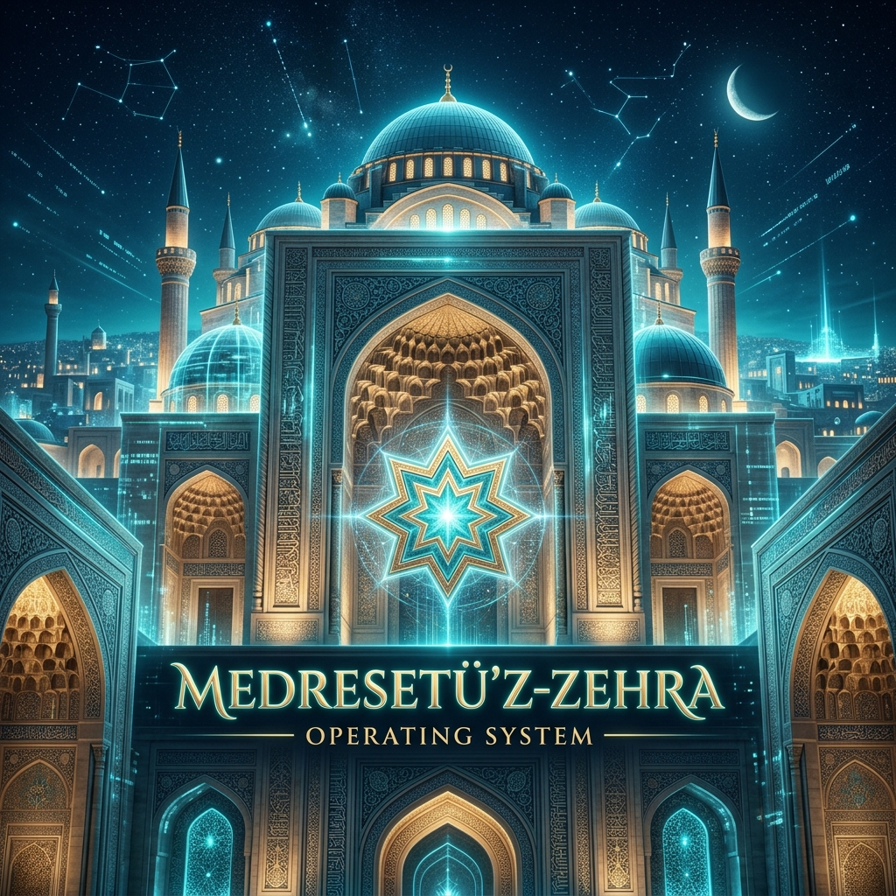



# 🏛️ AKADEMİK İŞLETİM SİSTEMİ
### *Mültidisipliner Ustalık — Milyar Dolarlık Bireyler İçin* 💎🚀

---

> **"Geleceğin dünyasını inşa eden 'Mültidisipliner Solopreneur'lar için tasarlanmış, yapay zeka entegreli akademik bir işletim sistemi ve bilgi cephaneliği."** 💎🦾🚀

---

## 🏛️ MİMARİ ŞEMA

```mermaid
graph TD
    A["🏛️ AKADEMİK İŞLETİM SİSTEMİ"] --> B["⚙️ MÜHENDİSLİK"]
    A --> C["🏛️ MİMARLIK & TASARIM"]
    A --> D["🔬 DOĞA BİLİMLERİ"]
    A --> E["🏥 TIP & SAĞLIK"]
    A --> F["⚖️ SOSYAL BİLİMLER"]
    A --> G["📉 İKTİSAT & İŞLETME"]
    A --> H["🚀 GELECEK TEKNOLOJİ"]
    A --> I["🎭 GÜZEL SANATLAR"]
    A --> J["📡 İLETİŞİM"]
    A --> K["⚖️ HUKUK"]
    A --> L["🌾 ZİRAAT & ÇEVRE"]
    A --> M["🎓 EĞİTİM"]
    A --> N["🕌 İLAHİYAT"]
    A --> O["🏃 SPOR"]
    A --> P["🏨 TURİZM"]

    subgraph "Temel Bilimler ve Mühendislik"
        B
        C
        D
    end

    subgraph "Sağlık ve Yaşam"
        E
        L
    end

    subgraph "Toplum ve İnsan"
        F
        G
        K
        J
    end

    subgraph "Vizyon ve Gelecek"
        H
        I
        M
        N
        O
        P
    end
```

---

> **"Kendi imparatorluğunu kurmak için gereken tüm akademik silahlar burada."** ⚔️🔥

---

## 🌌 Yeni Dünya Manifestosu: Mültidisipliner Zeka

Yapay zeka çağında, sadece bir "alan uzmanı" olmak yetersizdir. Gelecek, mühendislik kodunu hukuk etiğiyle, mimari estetiği ekonomik sürdürülebilirlikle birleştiren **"Mültidisipliner Solopreneur"**ların olacaktır.

> **"Geleceği tahmin etmenin tek yolu, onu mültidisipliner bir zekayla bizzat tasarlamaktır."** 🚀

---

## 🎓 BÖLÜMLER

Birim bazlı sınıflandırma olmaksızın, alfabetik sıraya göre YÖK standartlarındaki tam bölümler:

| Bölüm | Bölüm | Bölüm |
|:---|:---|:---|
| [Acil Yardim Ve Afet Yonetimi](acil_yardim_ve_afet_yonetimi) | [Adli Bilisim Muhendisligi](adli_bilisim_muhendisligi) | [Alman Dili Ve Edebiyati](alman_dili_ve_edebiyati) |
| [Ameliyathane Hizmetleri](ameliyathane_hizmetleri) | [Anestezi Ve Reanimasyon](anestezi_ve_reanimasyon) | [Antrenorluk Egitimi](antrenorluk_egitimi) |
| [Antropoloji](antropoloji) | [Arap Dili Ve Edebiyati](arap_dili_ve_edebiyati) | [Arkeoloji](arkeoloji) |
| [Astronomi Ve Uzay Bilimleri](astronomi_ve_uzay_bilimleri) | [Basin Yayin](basin_yayin) | [Beden Egitimi Ve Spor Bilimleri](beden_egitimi_ve_spor_bilimleri) |
| [Beden Egitimi Ve Spor Ogretmenligi](beden_egitimi_ve_spor_ogretmenligi) | [Beslenme Ve Diyetetik](beslenme_ve_diyetetik) | [Bilgisayar Muhendisligi](bilgisayar_muhendisligi) |
| [Bilgisayar Ve Ogretim Teknolojileri Egitimi](bilgisayar_ve_ogretim_teknolojileri_egitimi) | [Bilisim Sistemleri Muhendisligi](bilisim_sistemleri_muhendisligi) | [Biyoistatistik](biyoistatistik) |
| [Biyokimya Muhendisligi](biyokimya_muhendisligi) | [Biyoloji](biyoloji) | [Biyomedikal Muhendisligi](biyomedikal_muhendisligi) |
| [Biyomuhendislik](biyomuhendislik) | [Biyosistem Muhendisligi](biyosistem_muhendisligi) | [Calisma Ekonomisi Ve Endustri Iliskileri](calisma_ekonomisi_ve_endustri_iliskileri) |
| [Cevre Muhendisligi](cevre_muhendisligi) | [Cizgi Film Ve Animasyon](cizgi_film_ve_animasyon) | [Cocuk Gelisimi](cocuk_gelisimi) |
| [Cografya](cografya) | [Cografya Bolumu](cografya_bolumu) | [Deniz Ulastirma Isletme Muhendisligi](deniz_ulastirma_isletme_muhendisligi) |
| [Dil Ve Konusma Terapisi](dil_ve_konusma_terapisi) | [Dilbilim](dilbilim) | [Din Kulturu Ve Ahlak Bilgisi Ogretmenligi](din_kulturu_ve_ahlak_bilgisi_ogretmenligi) |
| [Dis Hekimligi](dis_hekimligi) | [Dis Ticaret](dis_ticaret) | [Ebelik](ebelik) |
| [Eczacilik](eczacilik) | [Ekonometri](ekonometri) | [Ekonomi](ekonomi) |
| [Elektrik Elektronik Muhendisligi](elektrik_elektronik_muhendisligi) | [Elektronik Ve Haberlesme Muhendisligi](elektronik_ve_haberlesme_muhendisligi) | [Endustri Muhendisligi](endustri_muhendisligi) |
| [Endustriyel Tasarim](endustriyel_tasarim) | [Endustriyel Tasarim Muhendisligi](endustriyel_tasarim_muhendisligi) | [Enerji Sistemleri Muhendisligi](enerji_sistemleri_muhendisligi) |
| [Enerji Yonetimi](enerji_yonetimi) | [Ergoterapi](ergoterapi) | [Felsefe](felsefe) |
| [Fen Bilgisi Ogretmenligi](fen_bilgisi_ogretmenligi) | [Fizik](fizik) | [Fizik Muhendisligi](fizik_muhendisligi) |
| [Fizyoterapi Ve Rehabilitasyon](fizyoterapi_ve_rehabilitasyon) | [Fotografcilik Ve Video](fotografcilik_ve_video) | [Fransiz Dili Ve Edebiyati](fransiz_dili_ve_edebiyati) |
| [Gastronomi Ve Mutfak Sanatlari](gastronomi_ve_mutfak_sanatlari) | [Gazetecilik](gazetecilik) | [Gemi Insaati Ve Gemi Makineleri Muhendisligi](gemi_insaati_ve_gemi_makineleri_muhendisligi) |
| [Gemi Makineleri Isletme Muhendisligi](gemi_makineleri_isletme_muhendisligi) | [Geomatik Muhendisligi](geomatik_muhendisligi) | [Gerontoloji](gerontoloji) |
| [Gida Muhendisligi](gida_muhendisligi) | [Girisimcilik](girisimcilik) | [Gorsel Iletisim Tasarimi](gorsel_iletisim_tasarimi) |
| [Grafik Tasarimi](grafik_tasarimi) | [Halkla Iliskiler Ve Reklamcilik](halkla_iliskiler_ve_reklamcilik) | [Harita Muhendisligi](harita_muhendisligi) |
| [Havacilik Ve Uzay Muhendisligi](havacilik_ve_uzay_muhendisligi) | [Havacilik Yonetimi](havacilik_yonetimi) | [Hemsirelik](hemsirelik) |
| [Hukuk](hukuk) | [Ic Mimarlik Ve Cevre Tasarimi](ic_mimarlik_ve_cevre_tasarimi) | [Iktisat](iktisat) |
| [Ilahiyat](ilahiyat) | [Ilkogretim Matematik Ogretmenligi](ilkogretim_matematik_ogretmenligi) | [Imalat Muhendisligi](imalat_muhendisligi) |
| [Ingiliz Dili Ve Edebiyati](ingiliz_dili_ve_edebiyati) | [Ingilizce Ogretmenligi](ingilizce_ogretmenligi) | [Insaat Muhendisligi](insaat_muhendisligi) |
| [Insaat Teknolojisi Muhendisligi](insaat_teknolojisi_muhendisligi) | [Insan Kaynaklari Yonetimi](insan_kaynaklari_yonetimi) | [Isletme](isletme) |
| [Isletme Muhendisligi](isletme_muhendisligi) | [Istatistik](istatistik) | [Jeofizik Muhendisligi](jeofizik_muhendisligi) |
| [Jeoloji](jeoloji) | [Jeoloji Muhendisligi](jeoloji_muhendisligi) | [Kimya](kimya) |
| [Kimya Bolumu](kimya_bolumu) | [Kimya Muhendisligi](kimya_muhendisligi) | [Konaklama Isletmeciligi](konaklama_isletmeciligi) |
| [Kontrol Ve Otomasyon Muhendisligi](kontrol_ve_otomasyon_muhendisligi) | [Kultur Varliklarini Koruma Ve Onarim](kultur_varliklarini_koruma_ve_onarim) | [Kuyumculuk Ve Mucevher Tasarimi](kuyumculuk_ve_mucevher_tasarimi) |
| [Lojistik Yonetimi](lojistik_yonetimi) | [Maden Muhendisligi](maden_muhendisligi) | [Makine Muhendisligi](makine_muhendisligi) |
| [Maliye](maliye) | [Matematik](matematik) | [Matematik Muhendisligi](matematik_muhendisligi) |
| [Mekatronik Muhendisligi](mekatronik_muhendisligi) | [Metalurji Ve Malzeme Muhendisligi](metalurji_ve_malzeme_muhendisligi) | [Mimarlik](mimarlik) |
| [Moda Ve Tekstil Tasarimi](moda_ve_tekstil_tasarimi) | [Molekuler Biyoloji Ve Genetik](molekuler_biyoloji_ve_genetik) | [Muhasebe Ve Finans Yonetimi](muhasebe_ve_finans_yonetimi) |
| [Mutercim Ve Tercumanlik](mutercim_ve_tercumanlik) | [Muzik](muzik) | [Muzik Ogretmenligi](muzik_ogretmenligi) |
| [Nanoteknoloji Muhendisligi](nanoteknoloji_muhendisligi) | [Nukleer Enerji Muhendisligi](nukleer_enerji_muhendisligi) | [Odyoloji](odyoloji) |
| [Okul Oncesi Ogretmenligi](okul_oncesi_ogretmenligi) | [Orman Muhendisligi](orman_muhendisligi) | [Otomotiv Muhendisligi](otomotiv_muhendisligi) |
| [Ozel Egitim Ogretmenligi](ozel_egitim_ogretmenligi) | [Ozurluluk Calismalari](ozurluluk_calismalari) | [Peyzaj Mimarligi](peyzaj_mimarligi) |
| [Psikoloji](psikoloji) | [Radyo Televizyon Ve Sinema](radyo_televizyon_ve_sinema) | [Rehberlik Ve Psikolojik Danismanlik](rehberlik_ve_psikolojik_danismanlik) |
| [Rekreasyon](rekreasyon) | [Resim Is Ogretmenligi](resim_is_ogretmenligi) | [Rus Dili Ve Edebiyati](rus_dili_ve_edebiyati) |
| [Saglik Bilgisi Ogretmenligi](saglik_bilgisi_ogretmenligi) | [Saglik Yonetimi](saglik_yonetimi) | [Sanat Tarihi](sanat_tarihi) |
| [Sehir Ve Bolge Planlama](sehir_ve_bolge_planlama) | [Seramik Ve Cam Tasarimi](seramik_ve_cam_tasarimi) | [Siber Guvenlik Muhendisligi](siber_guvenlik_muhendisligi) |
| [Sigortacilik Ve Risk Yonetimi](sigortacilik_ve_risk_yonetimi) | [Sinema Ve Televizyon](sinema_ve_televizyon) | [Sinif Ogretmenligi](sinif_ogretmenligi) |
| [Siyaset Bilimi Ve Kamu Yonetimi](siyaset_bilimi_ve_kamu_yonetimi) | [Sosyal Bilgiler Ogretmenligi](sosyal_bilgiler_ogretmenligi) | [Sosyal Hizmet](sosyal_hizmet) |
| [Sosyoloji](sosyoloji) | [Spor Yoneticiligi](spor_yoneticiligi) | [Su Urunleri Muhendisligi](su_urunleri_muhendisligi) |
| [Tarih](tarih) | [Tarim Makineleri Ve Teknolojileri Muhendisligi](tarim_makineleri_ve_teknolojileri_muhendisligi) | [Tekstil Muhendisligi](tekstil_muhendisligi) |
| [Tekstil Teknolojisi Muhendisligi](tekstil_teknolojisi_muhendisligi) | [Tekstil Ve Moda Tasarimi](tekstil_ve_moda_tasarimi) | [Tibbi Goruntuleme Teknikleri](tibbi_goruntuleme_teknikleri) |
| [Tibbi Laboratuvar Teknikleri](tibbi_laboratuvar_teknikleri) | [Tip](tip) | [Tiyatro Oyunculuk](tiyatro_oyunculuk) |
| [Turizm Isletmeciligi](turizm_isletmeciligi) | [Turizm Rehberligi](turizm_rehberligi) | [Turk Dili Ve Edebiyati](turk_dili_ve_edebiyati) |
| [Turkce Ogretmenligi](turkce_ogretmenligi) | [Ucak Muhendisligi](ucak_muhendisligi) | [Uluslararasi Iliskiler](uluslararasi_iliskiler) |
| [Uluslararasi Ticaret Ve Lojistik](uluslararasi_ticaret_ve_lojistik) | [Veterinerlik](veterinerlik) | [Yapay Zeka Ve Veri Muhendisligi](yapay_zeka_ve_veri_muhendisligi) |
| [Yazilim Muhendisligi](yazilim_muhendisligi) | [Yeni Medya Ve Iletisim](yeni_medya_ve_iletisim) | [Yiyecek Icecek Isletmeciligi](yiyecek_icecek_isletmeciligi) |
| [Yonetim Bilisim Sistemleri](yonetim_bilisim_sistemleri) | [Ziraat Muhendisligi](ziraat_muhendisligi) |  |

---

## 🔍 ÖZEL ARAŞTIRMA VE İLERİ UZMANLIK ALANLARI

Doğrudan lisans bölümü formatında olmayan ancak spesifik teknoloji alanları, lisansüstü programlar veya araştırma başlıkları (örneğin BCI, vb.):

| Özel Alan | Özel Alan | Özel Alan |
|:---|:---|:---|
| [3D Print Ai](ozel_arastirma_alanlari/3d_print_ai) | [Akustik Muhendisligi](ozel_arastirma_alanlari/akustik_muhendisligi) | [Artirilmis Gerceklik Muhendisligi](ozel_arastirma_alanlari/artirilmis_gerceklik_muhendisligi) |
| [Bci](ozel_arastirma_alanlari/bci) | [Biyoteknik Nanotip](ozel_arastirma_alanlari/biyoteknik_nanotip) | [Contex Engineering](ozel_arastirma_alanlari/contex_engineering) |
| [Egitim Yonetimi](ozel_arastirma_alanlari/egitim_yonetimi) | [Finans Muhendisligi](ozel_arastirma_alanlari/finans_muhendisligi) | [Fintek Ai](ozel_arastirma_alanlari/fintek_ai) |
| [Guzel Sanatlar](ozel_arastirma_alanlari/guzel_sanatlar) | [Hukuk Ve Ai Etigi](ozel_arastirma_alanlari/hukuk_ve_ai_etigi) | [Kuantum Muhendisligi](ozel_arastirma_alanlari/kuantum_muhendisligi) |
| [Metaverse](ozel_arastirma_alanlari/metaverse) | [Muhendislik Ortak](ozel_arastirma_alanlari/muhendislik_ortak) | [Nanoteknoloji Ai](ozel_arastirma_alanlari/nanoteknoloji_ai) |
| [Noro Muhendisligi](ozel_arastirma_alanlari/noro_muhendisligi) | [Optik Muhendisligi](ozel_arastirma_alanlari/optik_muhendisligi) | [Patlayici Muhendisligi](ozel_arastirma_alanlari/patlayici_muhendisligi) |

---

## 🧬 Mültidisipliner Sinerji Matrisi

| Alan A | Alan B | 🚀 Sinerji Sonucu |
| :--- | :--- | :--- |
| **Yazılım** | **Hukuk** | Akıllı sözleşmeler ve regülasyon uyumlu otonom sistemler. |
| **Mimarlık** | **Yapay Zeka** | Üretken tasarım (Generative Design) ve nöro-mimari mekanlar. |
| **Mühendislik** | **İktisat** | Maliyet optimizasyonlu otonom üretim tesisleri. |
| **Sosyoloji** | **Veri Bilimi** | Toplumsal davranış tahminleme ve dijital topluluk mühendisliği. |
| **Eğitim** | **AI** | Kişiselleştirilmiş öğrenme sistemleri ve adaptif pedagoji. |
| **Sağlık** | **Kuantum** | Kuantum tıp görüntüleme ve ilaç keşfi. |

---

## 🛠️ Solopreneur AI Araç Seti (V.2025)

> [!TIP]
> **"Harika bir zanaatkar, aletlerini en iyi tanıyan kişidir."**

### 🧠 Düşünce ve Strateji
- **Problem Çözme:** [Gemini 2.0 / GPT-o1] - Karmaşık analizler.
- **Veri Analizi:** [Claude 3.5 Sonnet] - Kod ve görselleştirme.
- **Akademik Araştırma:** [Perplexity AI] - Gerçek zamanlı bilgi.

### 🎨 Tasarım ve Estetik
- **Mimari & Görsel:** [Midjourney v6.1]
- **UI/UX:** [v0.dev / Figma AI]

### ⚙️ Operasyon ve Üretim
- **Otomasyon:** [Make.com / n8n]
- **Yazılım:** [Cursor / Windsurf]

---

## 🗺️ Gelecek Yol Haritası

- [ ] **Derinlemesine Ders Notları:** Her bölüm altına 101 ve ileri seviye ders içerikleri.
- [ ] **Interactive Playground:** Simülasyon araçları ve kod ortamları.
- [ ] **AI Entegrasyonu:** Her bölüme AI destekli özet ve soru-cevap eklentisi.

> **"Bilgi paylaşıldıkça çoğalır, mültidisipliner hale geldikçe güçlenir."** 🌐

---

## 🤝 Katkıda Bulunma

1. Bir **Issue** açın.
2. [`CONTRIBUTING.md`](CONTRIBUTING.md) dosyasını okuyun.
3. Kendi **Pull Request**inizi gönderin!

---

## ⚖️ Lisans

Bu repo **MIT Lisansı** ile korunmaktadır. Detaylar için [`LICENSE`](LICENSE) dosyasına bakın.

**Hazırlayan:** Bahattin Yunus Çetin  
*Mühendis & Araştırmacı*

[Linkedin](https://linkedin.com/in/bahattinyunuscetin) | [GitHub](https://github.com/bahattinyunus)

